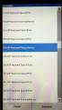
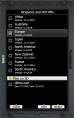
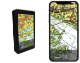

# Airspace
The FFVP and individual contributors are maintaining a file of French airspaces in the OpenAir (Extended) format and OpenAir (Standard).
It is compatible with SeeYou, SeeYou Navigator, SeeYou mobile, and most of the navigation systems used by glider pilots. This file is maintained on a voluntary basis.  
Initial source of information is the official [AIP](https://www.sia.aviation-civile.gouv.fr/documents/supaip/aip/id/6)  
[Documentation format OpenAir](http://www.winpilot.com/UsersGuide/UserAirspace.asp)  
[Documentation format OpenAir + OpenAir Extended - Naviter](https://github.com/naviter/seeyou_file_formats/blob/main/OpenAir_File_Format_Support.md)

### ZSM
The [Zones de Sensibilité Majeur](https://www.stac.aviation-civile.gouv.fr/fr/zsm) are updated on a regular basis from the KML file and the [Kml2OpenAir](https://github.com/llauner/kml2OpenAir) tool.

# Download
| File | Format | Auto. Gen. | Download |
| --- | --- | --- | --- |
| france.txt | OpenAir | :pencil2: |  [https://planeur-net.github.io/airspace/france.txt](https://planeur-net.github.io/airspace/france.txt)   [france--2025-07-10T19-15-58.txt](https://planeur-net.github.io/airspace/france--2025-07-10T19-15-58.txt)|
| france_openair_standard.txt | OpenAir | :heavy_check_mark: | [france_openair_standard.txt](https://planeur-net.github.io/airspace/france_openair_standard.txt)   [france_openair_standard--2025-07-10T19-15-58.txt](https://planeur-net.github.io/airspace/france_openair_standard--2025-07-10T19-15-58.txt)|
| france.cub | cub | :heavy_check_mark: |  [france.cub](https://planeur-net.github.io/airspace/france.cub)   [france--2025-07-10T19-15-58.cub](https://planeur-net.github.io/airspace/france--2025-07-10T19-15-58.cub) |
| france.geojson | geojson | :heavy_check_mark: | [france.geojson](https://planeur-net.github.io/airspace/france.geojson) | 

For your convenience while doing manual updates, we are also providing files with a date suffix in the file name.

# Integration
The airspace file *france.txt* is available in the following Apps or Devices:
| App / Device | Comment | Updates |
|--|--|--|
| XCSoar   | Config / System / Site Files / Airspaces / Download / FR-ASP-National-PlaneurNet.txt | Refresh / Update through Config menu |
|LXNav   | <h6>LXNav onboarded Airspace database (LX9070, 9000, 90xx, 80xx, ...)</h6> Setup / Files and Transfer / Airspaces and NOTAMs / Europe | As updated by LXNav  |
|Naviter   | <h6>Airspace database used by:  SeeYou, SeeYou Mobile, SeeYou Navigator, Oudie N, Omni </h6>| As updated by Naviter  |