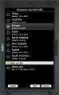
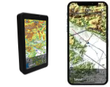

# Airspace
La FFVP met à jour un fichier des espaces aériens au format OpenAir Extended  et OpenAir (Standard), compatible avec SeeYou et la plupart des GPS utilisés par les vélivoles.  
Ce fichier est compilé bénévolement à partir des publications [AIP](https://www.sia.aviation-civile.gouv.fr/documents/supaip/aip/id/6) du Service de l’Information Aéronautique.  
[Documentation format OpenAir + OpenAir Extended - Naviter](https://github.com/naviter/seeyou_file_formats/blob/main/OpenAir_File_Format_Support.md)

### ZSM
Les [Zones de Sensibilité Majeur](https://www.stac.aviation-civile.gouv.fr/fr/zsm).  
Depuis l’**arrêt de la publication des fichiers d’export ZSM par le SIA**, l’information n’est accessible qu’au travers du [visualiseur cartographique](https://www.sia.aviation-civile.gouv.fr/vaip). Cette approche ne permet ni son utilisation en vol, ni son intégration dans des fichiers d’espaces aériens.  
*Une solution alternative, développée par des contributeurs et sans caractère officiel ni garantie, permet néanmoins de récupérer ces données*. Les mises à jour sont effectuées tous les quinze jours. 

[AIP France](https://www.sia.aviation-civile.gouv.fr/documents/htmlshow?f=dvd/eAIP_03_SEPT_2026/FRANCE/home.html): [ENR 5.6 Migrations d’oiseaux et zones fréquentées par une faune sensible](https://www.sia.aviation-civile.gouv.fr/media/dvd/eAIP_03_SEPT_2026/FRANCE/AIRAC-2026-09-03/html/eAIP/FR-ENR-5.6-fr-FR.html#ENR-5.6-1)

### OpenAir Standard / Extended
Le format OpenAir extended n’étant pas encore correctement supporté dans XCsoar ([#1340](https://github.com/XCSoar/XCSoar/issues/1340), [#1349](https://githubcom/XCSoar/XCSoar/pull/1349)) ou dans SeeYou Navigator, une version OpenAir Standard est générée automatiquement a partir de la version maintenue au format extended

# Download
| Fichier | Format | Gen. Auto. | Download |
| --- | --- | --- | --- |
| france-exp.txt | OpenAir | :pencil2: | [https://planeur-net.github.io/airspace/france-exp.txt](https://planeur-net.github.io/airspace/france-exp.txt)  Fichier france.txt avec indications de jour et heures d'activation (experimental)|
| france.txt | OpenAir | :heavy_check_mark:   :heavy_check_mark: | [https://planeur-net.github.io/airspace/france.txt](https://planeur-net.github.io/airspace/france.txt)   [france--2026-08-24T11-22-08Z.txt](https://planeur-net.github.io/airspace/france--2026-08-24T11-22-08Z.txt)|
| france-openair-standard.txt | OpenAir | :heavy_check_mark: | [france_openair_standard.txt](https://planeur-net.github.io/airspace/france_openair_standard.txt)   [france_openair_standard--2026-08-24T11-22-08Z.txt](https://planeur-net.github.io/airspace/france_openair_standard--2026-08-24T11-22-08Z.txt)|
| france.cub | cub | :heavy_check_mark: | [france.cub](https://planeur-net.github.io/airspace/france.cub)   [france--2026-08-24T11-22-08Z.cub](https://planeur-net.github.io/airspace/france--2026-08-24T11-22-08Z.cub) |
| france.geojson | geojson | :heavy_check_mark: | [france.geojson](https://planeur-net.github.io/airspace/france.geojson) |

Afin de simplifier la mise à jour manuelle, nous fournissons également un fichier contenant la date en suffixe de son nom.

# Integration
Le fichier *france.txt* est disponible nativement dans les applications ou matériels suivants:
| App / Device | Commentaire | Mises a jour |
|--|--|--|
| XCSoar   | Config / System / Site Files / Airspaces / Download / FR-ASP-National-PlaneurNet.txt | Via Config  |
|LXNav   | <h6>Base airspace LXNav (LX9070, 9000, 90xx, 80xx, ...)</h6>  Setup / Files and Transfer / Airspaces and NOTAMs / Europe | Mises a jour par LXNav  |
|Naviter   | <h6>Base airspace utilisee pour:  SeeYou, SeeYou Mobile, SeeYou Navigator, Oudie N, Omni </h6>| Mises a jour par Naviter  |
