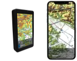

# Airspace
La FFVP met à jour un fichier des espaces aériens au format OpenAir Extended  et OpenAir (Standard), compatible avec SeeYou et la plupart des GPS utilisés par les vélivoles.  
Ce fichier est compilé bénévolement à partir des publications [AIP](https://www.sia.aviation-civile.gouv.fr/documents/supaip/aip/id/6) du Service de l’Information Aéronautique.  
[Documentation format OpenAir](http://www.winpilot.com/UsersGuide/UserAirspace.asp)  
[Documentation format OpenAir + OpenAir Extended - Naviter](https://github.com/naviter/seeyou_file_formats/blob/main/OpenAir_File_Format_Support.md)

### ZSM
Les [Zones de Sensibilité Majeur](https://www.stac.aviation-civile.gouv.fr/fr/zsm) sont mises a jour régulièrement a partir du fichier KML et de l'outil [Kml2OpenAir](https://github.com/llauner/kml2OpenAir)

### OpenAir Standard / Extended
Le format OpenAir extended n’étant pas encore correctement supporté dans XCsoar ([#1340](https://github.com/XCSoar/XCSoar/issues/1340), [#1349](https://githubcom/XCSoar/XCSoar/pull/1349)) ou dans SeeYou Navigator, une version OpenAir Standard est générée automatiquement a partir de la version maintenue au format extended

# Download
| Fichier | Format | Gen. Auto. | Download |
| --- | --- | --- | --- |
| france.txt | OpenAir | :pencil2:   :heavy_check_mark: | [https://planeur-net.github.io/airspace/france.txt](https://planeur-net.github.io/airspace/france.txt)   [france--2025-03-31T15-10-52.txt](https://planeur-net.github.io/airspace/france--2025-03-31T15-10-52.txt)|
| france-openair-standard.txt | OpenAir | :heavy_check_mark: | [france_openair_standard.txt](https://planeur-net.github.io/airspace/france_openair_standard.txt)   [france_openair_standard--2025-03-31T15-10-52.txt](https://planeur-net.github.io/airspace/france_openair_standard--2025-03-31T15-10-52.txt)|
| france.cub | cub | :heavy_check_mark: | [france.cub](https://planeur-net.github.io/airspace/france.cub)   [france--2025-03-31T15-10-52.cub](https://planeur-net.github.io/airspace/france--2025-03-31T15-10-52.cub) |
| france.geojson | geojson | :heavy_check_mark: | [france.geojson](https://planeur-net.github.io/airspace/france.geojson) |

Afin de simplifier la mise à jour manuelle, nous fournissons également un fichier contenant la date en suffixe de son nom.

# Integration
Le fichier *france.txt* est disponible nativement dans les applications ou matériels suivants:
| App / Device | Commentaire | Mises a jour |
|--|--|--|
| XCSoar   | Config / System / Site Files / Airspaces / Download / FR-ASP-National-PlaneurNet.txt | Via Config  |
|LXNav   | <h6>Base airspace LXNav (LX9070, 9000, 90xx, 80xx, ...)</h6>  Setup / Files and Transfer / Airspaces and NOTAMs / Europe | Mises a jour par LXNav  |
|Naviter   | <h6>Base airspace utilisee pour:  SeeYou, SeeYou Mobile, SeeYou Navigator, Oudie N, Omni </h6>| Mises a jour par Naviter  |
